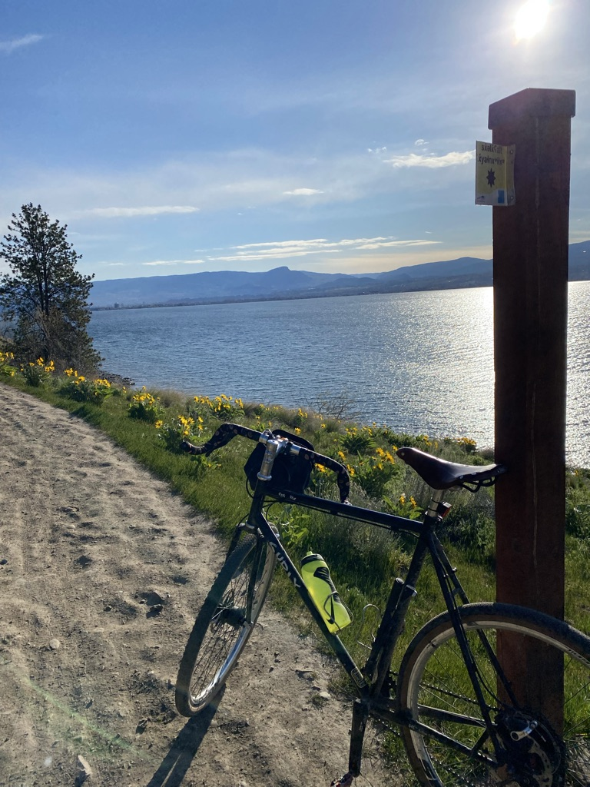

# TWU Faculty Professional Learning {-}

## Thursday, March 9, 2023 {-}

### Colin Madland, Manager, Online Learning and Instructional Technology (TWU GLOBAL) {-}

PhD Candidate, University of Victoria 

Slides - https://bit.ly/otessa22-b  
[Find me on the web...](https://cmad.land)  
[Twitter](https://twitter.com/colinmadland)  
[Mastodon](https://scholar.social/web/@Cmadland)  

**Presented Online at OTESSA22, May 17, 2022**

> I acknowledge that the land where I currently live and work remains the traditional, ancestral, and unceded land of the `syilx` (silks) people, whose historical stewardship of and connections to the land continue to today. I am grateful to be an uninvited guest on this land. [To learn more, please visit the Westbank First Nation website.](https://wfn.ca)

