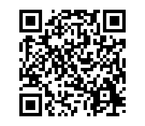
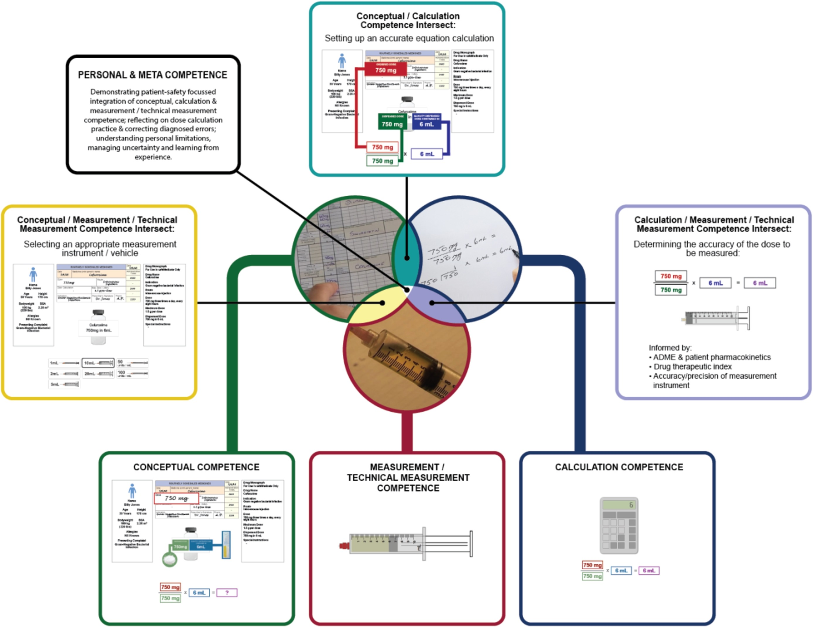
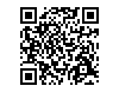
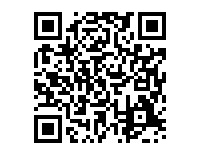
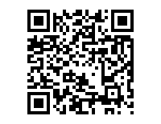
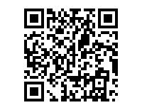
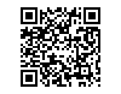
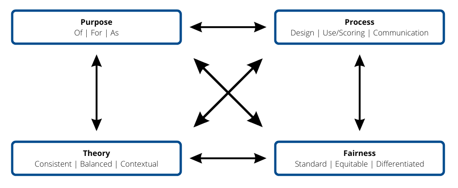

# TWU Faculty Professional Learning 

**Colin Madland, Manager, Online Learning and Instructional Technology (TWU GLOBAL) **

*PhD Candidate, University of Victoria *

Notes - <https://bit.ly/twu-assessment>


- [My web page](https://cmad.land){target="_blank"}   
- [Twitter](https://twitter.com/colinmadland){target="_blank"}    
- [Mastodon](https://scholar.social/web/@Cmadland){target="_blank"}   

**Presented Online for TWU Faculty Professional Learning, Thursday, March 9, 2023**

> I acknowledge that the land where I currently live and work remains the traditional, ancestral, and unceded land of the `syilx` (silks) people, whose historical stewardship of and connections to the land continue to today. I am grateful to be an uninvited guest on this land. [To learn more, please visit the syilx.org.](https:/syilx.org)


## What is 'assessment'?



<div style='position: relative; padding-bottom: 56.25%; padding-top: 35px; height: 0; overflow: hidden;'><iframe sandbox='allow-scripts allow-same-origin allow-presentation' allowfullscreen='true' allowtransparency='true' frameborder='0' height='315' src='https://www.mentimeter.com/app/presentation/alxgq7t592g9y112tyv7z3g7ysfnm9wc/embed' style='position: absolute; top: 0; left: 0; width: 100%; height: 100%;' width='420'></iframe></div>

**Pellegrino, J. W., Chudowsky, N., & Glaser, R. [_Knowing What Students Know: The Science and Design of Educational Assessment_](https://doi.org/10.17226/10019){target="_blank"}. National Academies Press. **

> "reasoning from evidence" (p. 43)    

> "a ***process*** of drawing reasonable ***inferences*** about what students know on the basis of ***evidence*** derived from ***observations*** of what they say, do, or make in ***selected situations***" (p. 112)  

And a quote usually ascribed to Paul Dressel at various times and in various publications...let me know if you find a verifiable source.

> A grade is an inadequate report of an inaccurate judgment by a biased and variable judge of the extent to which a student has attained an undefined level of mastery of an unknown proportion of an indefinite material. 

### The Assessment Triangle


The process of assessment begins with a detailed understanding and map of the cognitive construct that is to be learned. This might be the ability to correctly calculate doses of medication, or transpose a piece of music, or write an argumentative essay. Below is an example of nursing competence from Weeks et al. (2019).



Here are two documents in use in TWU Nursing. While these aren't constructed specifically as cognitive models of the domain, but instead as evaluation tools, the represent comprehesive models of what is required to demonstrate competency.

- [This is a checklist that nursing faculty use to allow learners to self-assess.](https://github.com/cmadland/decks/blob/main/assets/twu-asmt/mosby.pdf)  
- [And another used in practicum evaluations.](https://github.com/cmadland/decks/blob/main/assets/twu-asmt/n213.pdf)

The second component of the assessment triangle is an instrument of some kind designed to elicit the competencies mapped in the cognitive model. The instrument can vary widely from selected-response tests, videos, podcasts, performance tests in a lab, and many more.

The final component of assessment is an *inference* or *interpretation* of the data generated by the assessment instrument (not a *measurement*). The accuracy of the interpretation depends on how well the instrument aligns with the cognitive model (validity) and how stable the results are across populations (reliability).

```{block, type='reflect'}
One important thing to note is that many higher ed instructors (outside of faculties of education or psychology) do not tend to have much formal preparation in educational assessment, *however*, higher education instructors *do* have extensive background and preparation for conducting research. The assessment triangle above has many parallels to research (cognitive model/literature review; instrument to gather data; interpretation/discussion and conclusions).
```

## Thinking about your Approach to Assessment

<details>
<summary>Scenario 1 </summary>
<p>
> You are teaching a large enrollment course. The students will be submitting bi-weekly assignments, a midterm exam, and a culminating assignment all designed to support their learning.

1. How would you approach grading the bi-weekly assignments?    
2. How would you use data from learners' performance on the bi-weekly assignments?  
3. How would you respond to learners who have diverse abilities in relation to the culminating assignment?  
4. How would you deal with late assignments?   



<div style='position: relative; padding-bottom: 56.25%; padding-top: 35px; height: 0; overflow: hidden;'><iframe sandbox='allow-scripts allow-same-origin' allowfullscreen='true' allowtransparency='true' frameborder='0' height='315' src='https://www.mentimeter.com/app/presentation/alniopzk21jgwiysmg4d33ssv1y4c6tf/embed' style='position: absolute; top: 0; left: 0; width: 100%; height: 100%;' width='420'></iframe></div>

<!--
- Grade each bi-weekly assignment.  
- Read a subset of bi-weekly assignments, identify and share performance trends with the whole class.  
- Ask students to self-assess their bi-weekly assignments using evaluative criteria.  
- Use performance trends from the bi-weekly assignments to inform the redesign of the midterm or culminating assessment.  
- Develop a rubric or scoring guide to assess the culminating assignment in advance of student submissions.  
- Dedicate class time to discuss students’ performance trends from the midterm and address gaps in learning so students are better prepared for the culminating assignment.  
- Have every student complete the same culminating assignment using the same scoring rubric or guide.  
- Have all students complete the same culminating assignment with formal accommodations for students who require them.  
- Provide students with a choice of three different culminating assignments that assess the same learning goals.  
- Consistently apply late submission policies for all students when generating grades.  
- Consider each student’s individual circumstances when deciding how to apply late submission policies.  
- Use the late submission policy as a guideline to ensure a consistent principle is applied while also using professional judgement for students with individual circumstances.  

If your response to this scenario was not listed above, how would you most likely respond?
-->

</p>
</details>

<details>
<summary>Scenario 2 </summary>
<p>
> A core assignment in your course involves students working in groups online.

1. How would you ensure accountability and engagement with the assignment?
2. How would you communicate feedback with the group?
3. What factors would you consider when making grading decisions?
4. How would you manage unexpected events that disrupt a group's ability to complete the assignment?



<div style='position: relative; padding-bottom: 56.25%; padding-top: 35px; height: 0; overflow: hidden;'><iframe sandbox='allow-scripts allow-same-origin' allowfullscreen='true' allowtransparency='true' frameborder='0' height='315' src='https://www.mentimeter.com/app/presentation/alhwwpqhezprksbq4uo156e7t7zy48p4/embed' style='position: absolute; top: 0; left: 0; width: 100%; height: 100%;' width='420'></iframe></div>

<!--
- Grade the assignment solely based on the group’s final product.
- Engage students in an ongoing peer feedback process to enhance group collaboration.
- Engage students in self-assessment to increase their accountability and engagement in the assignment.
- Leverage online design features to engage students in peer feedback and self-assessment.
- Take group member feedback into consideration when generating final grades.
- Communicate grading decisions based on evaluation criteria and evidence of student learning.
- Give all group members the same grade.
- Monitor barriers to a student’s performance in group work (e.g., language, technology) and grade accordingly.
- Grade each student individually based on their contribution to the group’s process and product.
- Use the same rubric to consistently grade all groups’ assignments.
- Modify and apply the rubric differently in response to unexpected group events (e.g., group member leaves).
- Use the same rubric, but consider group composition, size, and cohesion when grading.

If your response to this scenario was not listed above, how would you most likely respond?
-->
</p>
</details>

<details>
<summary>Scenario 3</summary>
<p>
> There are expectations in your department that grades should be distributed across the grading scale. However, your class averages are consistently lower than your colleagues’. Your course assessment scheme includes two term exams and one final exam.

1. How might you incorporate assessment *for* learning into your assessment scheme?
2. How might you design the exams to address the gap?
3. What would be a fair approach to 'catching up' to your colleagues' course grades?
4. How might you analyze the exam scores to ensure reliability and validity?



<div style='position: relative; padding-bottom: 56.25%; padding-top: 35px; height: 0; overflow: hidden;'><iframe sandbox='allow-scripts allow-same-origin' allowfullscreen='true' allowtransparency='true' frameborder='0' height='315' src='https://www.mentimeter.com/app/presentation/aleko5rqzft5rfr82e4wch8umk54saow/embed' style='position: absolute; top: 0; left: 0; width: 100%; height: 100%;' width='420'></iframe></div>

<!--
- Provide students with additional graded assessments to chunk learning into smaller units.
- Provide students with additional opportunities to check their understanding throughout the course (e.g., ungraded quizzes, exit slips).
- Provide self-assessment opportunities to help students recognize and address gaps in their learning.
- Analyze exam results to determine if weak performance was due to exam design issues.
- Remove exam questions that most students struggled with and re-calculate student scores.
- Schedule class time to review exam performance to address learning gaps.
- Shift all exam grades up so averages are consistent with departmental colleagues.
- Provide students who performed below the class average with the opportunity to rewrite an equivalent exam.
- Provide any student the opportunity to rewrite an equivalent exam.
- Analyze the consistency of student performance across course exams.
- Analyze exam questions to ensure alignment with taught content.
- Analyze how students performed on exams in relation to taught content.

If your response to this scenario was not listed above, how would you most likely respond?
-->
</p>
</details>

<details>
<summary>Scenario 4 </summary>
<p>
> You teach a course with multiple sections taught by various instructors. Your students have complained to you that assignments are constructed and graded differently across sections.

1. How might different purposes of assessment (...of/for/as learning) impact your response to learners?
2. What design strategies could mitigate the perception (or reality) of inconsistent assignments across sections?
3. What strategies could you use to ensure fairness across sections?
4. How might you ensure that your assignments are 'measuring' the same things as your colleagues' assignments?



<div style='position: relative; padding-bottom: 56.25%; padding-top: 35px; height: 0; overflow: hidden;'><iframe sandbox='allow-scripts allow-same-origin' allowfullscreen='true' allowtransparency='true' frameborder='0' height='315' src='https://www.mentimeter.com/app/presentation/al9hd1zgr6e4uxczmcho5dxiiov2fmnd/embed' style='position: absolute; top: 0; left: 0; width: 100%; height: 100%;' width='420'></iframe></div>

<!--
- Explain to students that while learning outcomes are the same across sections, grades are based on their individual performance on assignments.
- Ensure students have the opportunity to receive feedback prior to submitting assignments to increase their focus on learning over grades.
- Invite students to reflect on their personal learning goals for the course so they can plan for their own success in your course.
- Engage in a collaborative design process with other instructors to set standards and design common assignments.
- Collaboratively score a subset of assignments with the other instructors to ensure consistent use of scoring guides across sections.
- Communicate your grading approach to your students and explain how it aligns with intended learning goals.
- Propose a standard approach to assignments and grading be applied across all sections.
- Assure students that while the assignments may be different across the sections, they assess the same learning outcomes.
- Offer students the opportunity to select and complete an assignment from another section.
- Work with the other instructors to revise all assignments across sections so they are all the same.
- Justify differences in approaches to assessment based on instructor orientations to assessment, teaching context, and students’ learning needs.
- Recognize student concerns and engage in practices that ensure your assignments are equivalent to those in other sections.

If your response to this scenario was not listed above, how would you most likely respond?
-->

</p>
</details>

<details>
<summary>Scenario 5 </summary>
<p>
> You discover that a student has plagiarized some of their assignment (e.g., an essay, lab report).

1. How might your response change if the purpose of the assignment was one of assessment of/for/as learning?
2. How might you adjust the design or deployment of the assignment to reduce plagiarism?
3. What factors would you consider in deciding how to proceed with the student?
4. How can you come to know what the student knows in relation to the learning outcomes?



<div style='position: relative; padding-bottom: 56.25%; padding-top: 35px; height: 0; overflow: hidden;'><iframe sandbox='allow-scripts allow-same-origin allow-presentation' allowfullscreen='true' allowtransparency='true' frameborder='0' height='315' src='https://www.mentimeter.com/app/presentation/algkuwe2gh1pxj379onh9gvkx326je9a/embed' style='position: absolute; top: 0; left: 0; width: 100%; height: 100%;' width='420'></iframe></div>

<!--
- Give the student a 0 on the assignment.
- Have the student re-write the plagiarized section in their own words, then re-grade the assignment.
- Ask the students to reflect on why plagiarism is a problem and what they would do differently next time.
- As the instructor, reflect on how the assignment could have been structured differently to deter plagiarism.
- Adjust the student’s grade to reflect the portion of work that was plagiarized.
- Discuss with the student the reasons for the plagiarism, severity of plagiarism, and negotiate potential next steps for their learning.
- Apply the same consequence you would for other students to ensure all students are treated the same.
- Consider if the student has identified accommodations before determining response to plagiarism.
- Discuss why the student plagiarized and agree upon an appropriate alternative assignment.
- Apply all aspects of institutional policy on academic integrity to ensure consistency across all students.
- Consider the original aspects of the assignment and the plagiarized text to determine what the student knows and does not appear to know related to learning outcomes.
- Consider extenuating circumstances surrounding the plagiarism and use professional judgement when applying the institutional academic integrity policy.

If your response to this scenario was not listed above, how would you most likely respond?
-->

</p>
</details>
<br>


## A Framework for Thinking about Assessment



DeLuca et al.'s model for assessment comprises four dimensions, each with three priority themes. Each of these dimensions influence the other dimensions, and all influence instructors' approaches to assessment. The term 'approaches to assessment' is intended to convey the reality that assessment in formal education is tremendously complex and idiosyncratic. Assessment literacy is not a checklist of competencies, 'best' practices, or rules. The dimensions and their themes are listed below:

- Assessment Purpose  
  - ...of learning  
  - ...for learning  
  - ...as learning  
- Assessment Processes  
  - design    
  - use and scoring  
  - communication  
- Assessment Fairness  
  - standard  
  - equitable  
  - balanced  
- Measurement Theory  
  - consistent  
  - balanced  
  - contextual  

## References {-}

DeLuca, C., LaPointe-McEwan, D., & Luhanga, U. (2016). [Approaches to classroom assessment inventory: A new instrument to support teacher assessment literacy.](https://doi.org/10/gfgtsg){target="_blank"} *Educational Assessment, 21*, 248–266.

Pellegrino, J. W., Chudowsky, N., & Glaser, R. (2001). [Knowing What Students Know: The Science and Design of Educational Assessment](https://doi.org/10.17226/10019){target="_blank"}. National Academies Press. 

Weeks, K. W., Coben, D., O’Neill, D., Jones, A., Weeks, A., Brown, M., & Pontin, D. (2019). [Developing and integrating nursing competence through authentic technology-enhanced clinical simulation education: Pedagogies for reconceptualising the theory-practice gap.](https://doi.org/10.1016/j.nepr.2019.04.010){target="_blank"} Nurse Education in Practice, 37, 29–38. 

