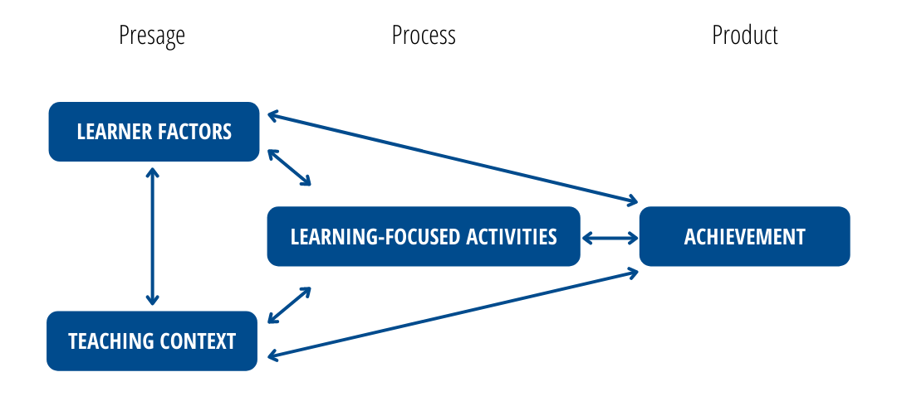
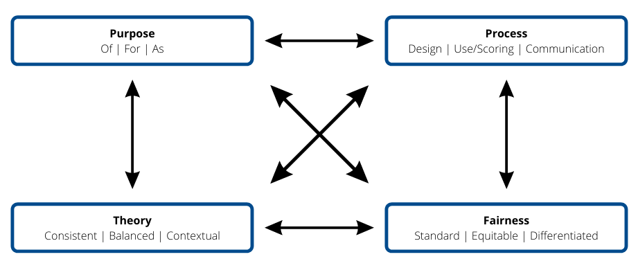
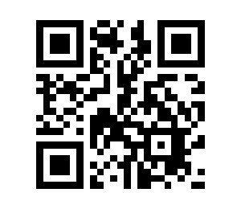
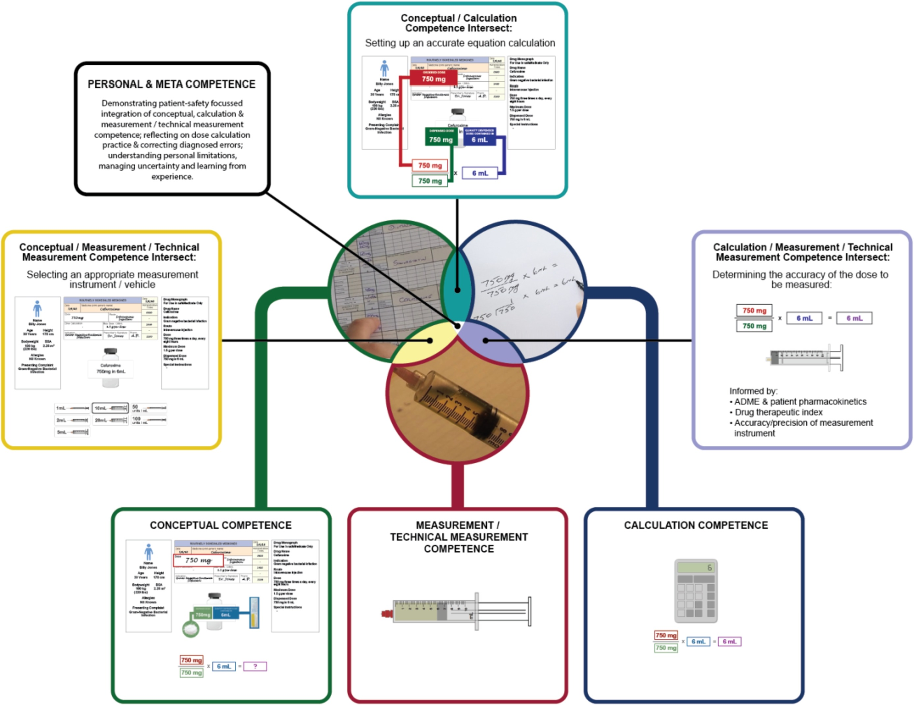
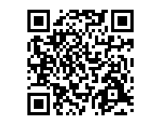
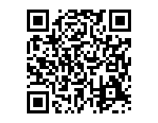
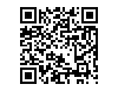
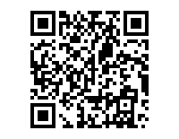
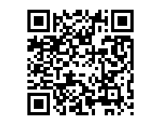
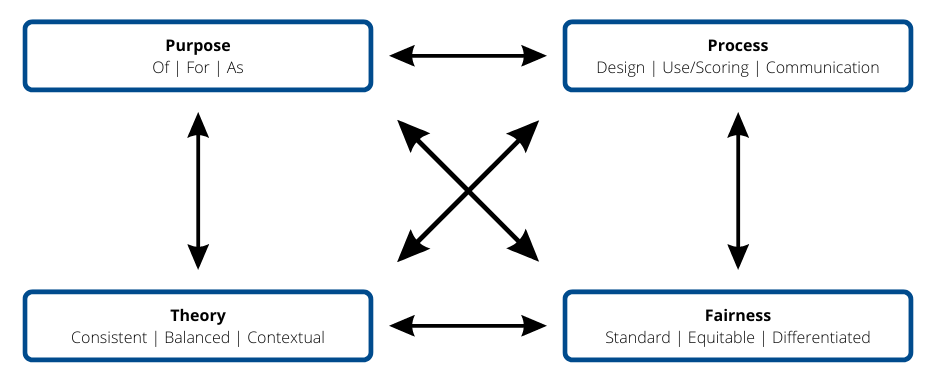

--- 
title: "Presentations"
author: "Colin Madland"
date: "Last updated: `r Sys.Date()`"
site: bookdown::bookdown_site
output: bookdown::gitbook
documentclass: book
bibliography: [book.bib]
biblio-style: apalike
link-citations: yes
github-repo: rstudio/bookdown-demo
description: "This is a minimal example of using the bookdown package to host presentations. The output format for this example is bookdown::gitbook."
---

# Welcome {-}

Please use the table of contents on the left to navigate through my presentations.

<!--chapter:end:index.Rmd-->

# OTESSA22 - Assessment and Digital Technology in Higher Education 


## Introduction {-}

### Colin Madland, PhD Candidate, University of Victoria {-}

Slides - https://bit.ly/otessa22-b  
[Find me on the web...](https://cmad.land)  
[Twitter](https://twitter.com/colinmadland)  
[Mastodon](https://scholar.social/web/@Cmadland)  

**Presented Online at OTESSA22, May 17, 2022**

> I acknowledge that the land where I currently live and work remains the traditional, ancestral, and unceded land of the `syilx` (silks) people, whose historical stewardship of and connections to the land continue to today. I am grateful to be an uninvited guest on this land. [To learn more, please visit the Westbank First Nation website.](https://wfn.ca)


### Hypothes.is {-}

[If you haven't already, feel free to sign up here as we will use hypothes.is later](https://web.hypothes.is/start/). Also, if you have questions or comments, please annotate to your heart's content!

### Background {-}

This review is guided by four research questions:
  
1. What are the major themes or patterns in the literature related to approaches to assessment in higher education?  
2. What are the major themes or patterns in the literature related to the impact of technology on assessment in higher education?  
3. What gaps exist in the literature related to approaches to assessment in technology-mediated higher education?

#### Scriven, 1967 {-}

> Scriven, M. (1967). _The methodology of evaluation._ In B. O. Smith (Ed.), _Perspectives of curriculum evaluation_. Rand McNally

- distinction between `formative` and `summative`

#### Bloom, 1968 {-}

>Bloom, B. (1968). Learning for Mastery. Instruction and Curriculum. Regional Education Laboratory for the Carolinas and Virginia, Topical Papers and Reprints, Number 1. *Evaluation Comment, 1*(2), 12.

- Incorporated `formative` and `summative` distinction into his ideas about `mastery learning`


#### Mislevy, 1994 {-}

>Mislevy, R. J. (1994). Test theory reconcieved. _ETS Research Report Series, 1994_(1), i–38. https://doi.org/10/gjm236

- >test theory is machinery for reasoning from students' behavior to conjectures about their competence, as framed in a particular conception of competence."(p. 4).
  
#### Black and Wiliam, 1998 {-}

> Black, P., & Wiliam, D. (1998). Assessment and Classroom Learning. *Assessment in Education: Principles, Policy & Practice, 5*(1), 7–74. https://doi.org/10/fpnss4

- major review of the literature on `formative assessment`  
- describe formative assessment as encouraging gains in achievement that were  

	  > among the largest ever reported for educational interventions (p. 61)

#### Pellegrino et al., 2001 {-}

>Pellegrino, J. W., Chudowsky, N., & Glaser, R. (2001). _Knowing What Students Know: The Science and Design of Educational Assessment_. National Academies Press. https://doi.org/10.17226/10019

- "a process of drawing reasonable inferences about what students know on the basis of evidence derived from observations of what they say, do, or make in selected situations" (p. 112)  
- "reasoning from evidence" (p. 43)  

##### Assessment Triangle {-}

 Cognition, Observation, and Interpretation. There are two-way arrows pointing between each of the sides.")

###### Cognition {-}
- a cognitive model of the domain

###### Observation {-}

- a performance task used to gather data regarding learner achievement

###### Interpretation {-}

- an inference or judgement of the learner's achievement in relation to the model of the domain


### Approaches to Learning {-}

#### Biggs, 1993 {-}

>Biggs, J. B. (1993). From Theory to Practice: A Cognitive Systems Approach. *Higher Education Research & Development, 12*(1), 73–85. https://doi.org/10/ccdmd9



##### Presage {-}

- factors that precede learning activities  
  - learner factors  
    - prior knowledge  
    - educational experience  
    - affective states  
    - wellness (physical & mental)  
  - teacher factors  
    - vertical & horizontal discourses (Bernstein, 1999)  
    - institutional policies  
    - department norms  
    - educational experiences  

##### Process {-}

- learning focused activities
  - reading, writing, discussing, building, creating, synthesizing, researching, sharing, debating, publishing...
- surface approaches
  - using low-level cognitive skills when high-level cognitive skills are required
- deep approaches
  - using high-level cognitive skills for tasks which require them

##### Product {-}

- learner achievement of outcomes (intended or emergent)
- fed back into the system
  - informs learners and instructors


### Conceptions of Assessment {-}

#### Brown, 1994; 1996 {-}

>Brown, G. T. L. (2004). Teachers’ conceptions of assessment: Implications for policy and professional development. *Assessment in Education: Principles, Policy & Practice, 11*(3), 301–318. https://doi.org/10.1080/0969594042000304609

>Brown, G. T. L. (2006). Teachers’ Conceptions of Assessment: Validation of an Abridged Version. *Psychological Reports, 99*(1), 166–170. https://doi.org/10/bf67hf


- general mental structure, encompassing beliefs, meanings, concepts, propositions, rules, mental images, preferences
  - improvement of teaching and learning,  
  - school accountability,  
  - student accountability, or  
  - treating assessment as irrelevant.

#### Fletcher et al., 2012 {-}

>Fletcher, R. B., Meyer, L. H., Anderson, H., Johnston, P., & Rees, M. (2012). Faculty and Students Conceptions of Assessment in Higher Education. *Higher Education, 64*(1), 119–133. https://doi.org/10/ctccpq

- instructors were more likely than learners to view assessment as consistent and trustworthy methods to understand and improve learning  
- learners were more likely to have negative views of assessment and viewed it as a measure of student and institutional accountability.

#### Earl, 2013 {-}

>Earl, L. M. (2013). *Assessment as learning: Using classroom assessment to maximize student learning (Second edition)*. Corwin Press.

- Assessment *OF* Learning
  - summative
- Assessment *FOR* Learning
  - formative
- Assessment *AS* Learning
  - metacognitive

### Approaches to Assessment {-}

Both learning and assessment are complex phenomena which are impacted by myriad factors.

#### Shepard (2000) {-}

>Shepard, L. A. (2000). The Role of Assessment in a Learning Culture. *Educational Researcher, 29*(7), 4–14. https://doi.org/10/cw9jwc

- traditional assessment structures originated in behaviourist models of teaching and learning
  - emphasis on culture of summative assessment
- modern constructivist models of teaching and learning are less compatible with previous assessment structures, yet a culture that emphasizes summative assessment seems to persist alongside emerging models of assessment

#### DeLuca, 2016 {-}

>DeLuca, C., LaPointe-McEwan, D., & Luhanga, U. (2016). Approaches to classroom assessment inventory: A new instrument to support teacher assessment literacy. *Educational Assessment, 21*, 248–266. https://doi.org/10/gfgtsg



- *Approaches to Classroom Assessment Inventory*  
  - designed to inventory K12 teachers' thoughts, beliefs, actions related to assessment  
    - Assessment purpose (of, for, as learning)  
    - Assessment process (design, use/scoring, communication)  
    - Assessment fairness (standard, equitable, differentiated)  
    - Assessment theory (consistent, balanced, contextual)  

## Technology-Mediated Assessment in Higher Education {-}

### Contrasting with K12 {-}

There is a very large body of literature on assessment in K12 learning contexts, and a not-quite as large, but still substantial body of literature on assessment in higher education. It may be tempting to conflate the two contexts, but K12 teachers typically complete 2 full years of pedagogical training as part of their academic and practical preparation. These two years often include specific courses on assessment, learning theory, as well as domain-specific pedagogies.

On the other hand, higher education instructors (from part-time sessionals to adjuncts to tenure-track and tenured faculty) tend to engage in little academic preparation in learning theories or assessment, although they seem to absorb the signature pedagogies of their discipline. 

### Impact of Technology {-}

- Impact on higher education is ubiquitous (SIS, LMS/VLE, CRM, etc.)
- Tends to emphasize `efficiency` (however ill-defined that may be)
  - doing the same things with greater speed and/or reduced effort
  - reinscribes mis-aligned assessment structures

#### Pockets of Innovation {-}
  
#### Bearman et al. 2020 {-}

>Bearman, M., Dawson, P., Ajjawi, R., Tai, J., & Boud, D. (Eds.). (2020). *Re-imagining university assessment in a digital world.* Springer.

- cognitive offloading  
- artificial intelligence  
  - "personalized" learning; recommender systems, automated item generation, automated essay scoring  
- dialogic feedback  
  - video, audio, screencast  
- data & learning analytics  
  - process data  
- peer/self-assessment
- micro-credentials

However...

- critical to consider ethical and social impacts!
  - surveillance
  - equity
  - algorithmic assessment

#### Bower, 2019 {-}

>Bower, M. (2019). Technology‐mediated learning theory. *British Journal of Educational Technology, 50*(3), 1035–1048. https://doi.org/10.1111/bjet.12771

>In technology-mediated learning contexts, agentic intentions reside with humans, and not with technology.

- 3 (select) premises  
  - technology `mediates` between learners and outcomes  
  - beliefs, knowledge, practices, and environment are mutually influential (add this to the complexity of assessment)  
  - role of teachers is to optimise learning through the `purposeful deployment` of learning technologies  


### Revisiting Shepard (2000) {-}

**Using hypothes.is**  

- 22 years have passed...  
- What has changed?  
- What is your experience of technology-mediated assessment in higher education?  
- What are your greatest challenges related to technology-mediated assessment?


## Themes and Research Directions {-}

- assessment as conversation in digital environments  
- validity exploration of *Approaches to Assessment* in higher ed.  
- humanizing assessment, ethics  

## Questions? Comments? {-}


## References {-}

Bearman, M., Dawson, P., Ajjawi, R., Tai, J., & Boud, D. (Eds.). (2020). *Re-imagining university assessment in a digital world.* Springer.

Bernstein, B. (1999). Vertical and Horizontal Discourse: An Essay. *British Journal of Sociology of Education, 20*(2), 157–173. JSTOR. https://doi.org/10/ftmsvc

Biggs, J. B. (1993). From Theory to Practice: A Cognitive Systems Approach. *Higher Education Research & Development, 12*(1), 73–85. https://doi.org/10/ccdmd9

Black, P., & Wiliam, D. (1998). Assessment and Classroom Learning. *Assessment in Education: Principles, Policy & Practice, 5*(1), 7–74. https://doi.org/10/fpnss4

Bloom, B. (1968). Learning for Mastery. Instruction and Curriculum. Regional Education Laboratory for the Carolinas and Virginia, Topical Papers and Reprints, Number 1. *Evaluation Comment, 1*(2), 12.

Bower, M. (2019). Technology‐mediated learning theory. *British Journal of Educational Technology, 50*(3), 1035–1048. https://doi.org/10.1111/bjet.12771

Brown, G. T. L. (2004). Teachers’ conceptions of assessment: Implications for policy and professional development. *Assessment in Education: Principles, Policy & Practice, 11*(3), 301–318. https://doi.org/10.1080/0969594042000304609

Brown, G. T. L. (2006). Teachers’ Conceptions of Assessment: Validation of an Abridged Version. *Psychological Reports, 99*(1), 166–170. https://doi.org/10/bf67hf

DeLuca, C., LaPointe-McEwan, D., & Luhanga, U. (2016). Approaches to classroom assessment inventory: A new instrument to support teacher assessment literacy. *Educational Assessment, 21*, 248–266. https://doi.org/10/gfgtsg

DeLuca, C., Willis, J., Cowie, B., Harrison, C., Coombs, A., Gibson, A., & Trask, S. (2019). Policies, Programs, and Practices: Exploring the Complex Dynamics of Assessment Education in Teacher Education Across Four Countries. *Frontiers in Education, 4*, 132. https://doi.org/10/gh5k2r

Earl, L. M. (2013). *Assessment as learning: Using classroom assessment to maximize student learning (Second edition)*. Corwin Press.

Fletcher, R. B., Meyer, L. H., Anderson, H., Johnston, P., & Rees, M. (2012). Faculty and Students Conceptions of Assessment in Higher Education. *Higher Education, 64*(1), 119–133. https://doi.org/10/ctccpq

Mislevy, R. J. (1994). Test theory reconcieved. _ETS Research Report Series, 1994_(1), i–38. https://doi.org/10/gjm236

Pellegrino, J. W., Chudowsky, N., & Glaser, R. (2001). _Knowing What Students Know: The Science and Design of Educational Assessment_. National Academies Press. https://doi.org/10.17226/10019

Scriven, M. (1967). _The methodology of evaluation._ In B. O. Smith (Ed.), _Perspectives of curriculum evaluation_. Rand McNally

Shepard, L. A. (2000). The Role of Assessment in a Learning Culture. *Educational Researcher, 29*(7), 4–14. https://doi.org/10/cw9jwc


<!--chapter:end:01-otessa22-assessment.Rmd-->

# TWU Faculty Professional Learning 

**Colin Madland, Manager, Online Learning and Instructional Technology (TWU GLOBAL) **

*PhD Candidate, University of Victoria *

Notes - <https://bit.ly/twu-assessment>



[Find me on the web...](https://cmad.land){target="_blank"} 
[Twitter](https://twitter.com/colinmadland){target="_blank"}  
[Mastodon](https://scholar.social/web/@Cmadland){target="_blank"}  

**Presented Online for TWU Faculty Professional Learning, Thursday, March 9, 2023**

> I acknowledge that the land where I currently live and work remains the traditional, ancestral, and unceded land of the `syilx` (silks) people, whose historical stewardship of and connections to the land continue to today. I am grateful to be an uninvited guest on this land. [To learn more, please visit the syilx.org.](https:/syilx.org)


## What is 'assessment'?


<div style='position: relative; padding-bottom: 56.25%; padding-top: 35px; height: 0; overflow: hidden;'><iframe sandbox='allow-scripts allow-same-origin allow-presentation' allowfullscreen='true' allowtransparency='true' frameborder='0' height='315' src='https://www.mentimeter.com/app/presentation/alxgq7t592g9y112tyv7z3g7ysfnm9wc/embed' style='position: absolute; top: 0; left: 0; width: 100%; height: 100%;' width='420'></iframe></div>

**Pellegrino, J. W., Chudowsky, N., & Glaser, R. [_Knowing What Students Know: The Science and Design of Educational Assessment_](https://doi.org/10.17226/10019){target="_blank"}. National Academies Press. **


> "reasoning from evidence" (p. 43)    

> "a ***process*** of drawing reasonable ***inferences*** about what students know on the basis of ***evidence*** derived from ***observations*** of what they say, do, or make in ***selected situations***" (p. 112)  

### The Assessment Triangle


The process of assessment begins with a detailed understanding and map of the cognitive construct that is to be learned. This might be the ability to correctly calculate doses of medication, or transpose a piece of music, or write an argumentative essay. Below is an example of nursing competence from Weeks et al. (2019).



Here are two documents in use in TWU Nursing. While these aren't constructed specifically as cognitive models of the domain, but instead as evaluation tools, the represent comprehesive models of what is required to demonstrate competency.

-   
- 

The second component of the assessment triangle is an instrument of some kind designed to elicit the competencies mapped in the cognitive model. The instrument can vary widely from selected-response tests, videos, podcasts, performance tests in a lab, and many more.

The final component of assessment is an *inference* or *interpretation* of the data generated by the assessment instrument (not a *measurement*). The accuracy of the interpretation depends on how well the instrument aligns with the cognitive model (validity) and how stable the results are across populations (reliability).

```{block, type='reflect'}
One important thing to note is that many higher ed instructors (outside of faculties of education or psychology) do not tend to have much formal preparation in educational assessment, *however*, higher education instructors *do* have extensive background and preparation for conducting research. The assessment triangle above has many parallels to research (cognitive model/literature review; instrument to gather data; interpretation/discussion and conclusions).
```

## Thinking about your Approach to Assessment

<details>
<summary>Scenario 1 </summary>
<p>
> You are teaching a large enrollment course. The students will be submitting bi-weekly assignments, a midterm exam, and a culminating assignment all designed to support their learning.

1. How would you approach grading the bi-weekly assignments?    
2. How would you use data from learners' performance on the bi-weekly assignments?  
3. How would you respond to learners who have diverse abilities in relation to the culminating assignment?  
4. How would you deal with late assignments?   



<div style='position: relative; padding-bottom: 56.25%; padding-top: 35px; height: 0; overflow: hidden;'><iframe sandbox='allow-scripts allow-same-origin' allowfullscreen='true' allowtransparency='true' frameborder='0' height='315' src='https://www.mentimeter.com/app/presentation/alniopzk21jgwiysmg4d33ssv1y4c6tf/embed' style='position: absolute; top: 0; left: 0; width: 100%; height: 100%;' width='420'></iframe></div>

<!--
- Grade each bi-weekly assignment.  
- Read a subset of bi-weekly assignments, identify and share performance trends with the whole class.  
- Ask students to self-assess their bi-weekly assignments using evaluative criteria.  
- Use performance trends from the bi-weekly assignments to inform the redesign of the midterm or culminating assessment.  
- Develop a rubric or scoring guide to assess the culminating assignment in advance of student submissions.  
- Dedicate class time to discuss students’ performance trends from the midterm and address gaps in learning so students are better prepared for the culminating assignment.  
- Have every student complete the same culminating assignment using the same scoring rubric or guide.  
- Have all students complete the same culminating assignment with formal accommodations for students who require them.  
- Provide students with a choice of three different culminating assignments that assess the same learning goals.  
- Consistently apply late submission policies for all students when generating grades.  
- Consider each student’s individual circumstances when deciding how to apply late submission policies.  
- Use the late submission policy as a guideline to ensure a consistent principle is applied while also using professional judgement for students with individual circumstances.  

If your response to this scenario was not listed above, how would you most likely respond?
-->

</p>
</details>

<details>
<summary>Scenario 2 </summary>
<p>
> A core assignment in your course involves students working in groups online.

1. How would you ensure accountability and engagement with the assignment?
2. How would you communicate feedback with the group?
3. What factors would you consider when making grading decisions?
4. How would you manage unexpected events that disrupt a group's ability to complete the assignment?



<div style='position: relative; padding-bottom: 56.25%; padding-top: 35px; height: 0; overflow: hidden;'><iframe sandbox='allow-scripts allow-same-origin' allowfullscreen='true' allowtransparency='true' frameborder='0' height='315' src='https://www.mentimeter.com/app/presentation/alhwwpqhezprksbq4uo156e7t7zy48p4/embed' style='position: absolute; top: 0; left: 0; width: 100%; height: 100%;' width='420'></iframe></div>

<!--
- Grade the assignment solely based on the group’s final product.
- Engage students in an ongoing peer feedback process to enhance group collaboration.
- Engage students in self-assessment to increase their accountability and engagement in the assignment.
- Leverage online design features to engage students in peer feedback and self-assessment.
- Take group member feedback into consideration when generating final grades.
- Communicate grading decisions based on evaluation criteria and evidence of student learning.
- Give all group members the same grade.
- Monitor barriers to a student’s performance in group work (e.g., language, technology) and grade accordingly.
- Grade each student individually based on their contribution to the group’s process and product.
- Use the same rubric to consistently grade all groups’ assignments.
- Modify and apply the rubric differently in response to unexpected group events (e.g., group member leaves).
- Use the same rubric, but consider group composition, size, and cohesion when grading.

If your response to this scenario was not listed above, how would you most likely respond?
-->
</p>
</details>

<details>
<summary>Scenario 3</summary>
<p>
> There are expectations in your department that grades should be distributed across the grading scale. However, your class averages are consistently lower than your colleagues’. Your course assessment scheme includes two term exams and one final exam.

1. How might you incorporate assessment *for* learning into your assessment scheme?
2. How might you design the exams to address the gap?
3. What would be a fair approach to 'catching up' to your colleagues' course grades?
4. How might you analyze the exam scores to ensure reliability and validity?



<div style='position: relative; padding-bottom: 56.25%; padding-top: 35px; height: 0; overflow: hidden;'><iframe sandbox='allow-scripts allow-same-origin' allowfullscreen='true' allowtransparency='true' frameborder='0' height='315' src='https://www.mentimeter.com/app/presentation/aleko5rqzft5rfr82e4wch8umk54saow/embed' style='position: absolute; top: 0; left: 0; width: 100%; height: 100%;' width='420'></iframe></div>

<!--
- Provide students with additional graded assessments to chunk learning into smaller units.
- Provide students with additional opportunities to check their understanding throughout the course (e.g., ungraded quizzes, exit slips).
- Provide self-assessment opportunities to help students recognize and address gaps in their learning.
- Analyze exam results to determine if weak performance was due to exam design issues.
- Remove exam questions that most students struggled with and re-calculate student scores.
- Schedule class time to review exam performance to address learning gaps.
- Shift all exam grades up so averages are consistent with departmental colleagues.
- Provide students who performed below the class average with the opportunity to rewrite an equivalent exam.
- Provide any student the opportunity to rewrite an equivalent exam.
- Analyze the consistency of student performance across course exams.
- Analyze exam questions to ensure alignment with taught content.
- Analyze how students performed on exams in relation to taught content.

If your response to this scenario was not listed above, how would you most likely respond?
-->
</p>
</details>

<details>
<summary>Scenario 4 </summary>
<p>
> You teach a course with multiple sections taught by various instructors. Your students have complained to you that assignments are constructed and graded differently across sections.

1. How might different purposes of assessment (...of/for/as learning) impact your response to learners?
2. What design strategies could mitigate the perception (or reality) of inconsistent assignments across sections?
3. What strategies could you use to ensure fairness across sections?
4. How might you ensure that your assignments are 'measuring' the same things as your colleagues' assignments?



<div style='position: relative; padding-bottom: 56.25%; padding-top: 35px; height: 0; overflow: hidden;'><iframe sandbox='allow-scripts allow-same-origin' allowfullscreen='true' allowtransparency='true' frameborder='0' height='315' src='https://www.mentimeter.com/app/presentation/al9hd1zgr6e4uxczmcho5dxiiov2fmnd/embed' style='position: absolute; top: 0; left: 0; width: 100%; height: 100%;' width='420'></iframe></div>

<!--
- Explain to students that while learning outcomes are the same across sections, grades are based on their individual performance on assignments.
- Ensure students have the opportunity to receive feedback prior to submitting assignments to increase their focus on learning over grades.
- Invite students to reflect on their personal learning goals for the course so they can plan for their own success in your course.
- Engage in a collaborative design process with other instructors to set standards and design common assignments.
- Collaboratively score a subset of assignments with the other instructors to ensure consistent use of scoring guides across sections.
- Communicate your grading approach to your students and explain how it aligns with intended learning goals.
- Propose a standard approach to assignments and grading be applied across all sections.
- Assure students that while the assignments may be different across the sections, they assess the same learning outcomes.
- Offer students the opportunity to select and complete an assignment from another section.
- Work with the other instructors to revise all assignments across sections so they are all the same.
- Justify differences in approaches to assessment based on instructor orientations to assessment, teaching context, and students’ learning needs.
- Recognize student concerns and engage in practices that ensure your assignments are equivalent to those in other sections.

If your response to this scenario was not listed above, how would you most likely respond?
-->

</p>
</details>

<details>
<summary>Scenario 5 </summary>
<p>
> You discover that a student has plagiarized some of their assignment (e.g., an essay, lab report).

1. How might your response change if the purpose of the assignment was one of assessment of/for/as learning?
2. How might you adjust the design or deployment of the assignment to reduce plagiarism?
3. What factors would you consider in deciding how to proceed with the student?
4. How can you come to know what the student knows in relation to the learning outcomes?



<div style='position: relative; padding-bottom: 56.25%; padding-top: 35px; height: 0; overflow: hidden;'><iframe sandbox='allow-scripts allow-same-origin allow-presentation' allowfullscreen='true' allowtransparency='true' frameborder='0' height='315' src='https://www.mentimeter.com/app/presentation/algkuwe2gh1pxj379onh9gvkx326je9a/embed' style='position: absolute; top: 0; left: 0; width: 100%; height: 100%;' width='420'></iframe></div>

<!--
- Give the student a 0 on the assignment.
- Have the student re-write the plagiarized section in their own words, then re-grade the assignment.
- Ask the students to reflect on why plagiarism is a problem and what they would do differently next time.
- As the instructor, reflect on how the assignment could have been structured differently to deter plagiarism.
- Adjust the student’s grade to reflect the portion of work that was plagiarized.
- Discuss with the student the reasons for the plagiarism, severity of plagiarism, and negotiate potential next steps for their learning.
- Apply the same consequence you would for other students to ensure all students are treated the same.
- Consider if the student has identified accommodations before determining response to plagiarism.
- Discuss why the student plagiarized and agree upon an appropriate alternative assignment.
- Apply all aspects of institutional policy on academic integrity to ensure consistency across all students.
- Consider the original aspects of the assignment and the plagiarized text to determine what the student knows and does not appear to know related to learning outcomes.
- Consider extenuating circumstances surrounding the plagiarism and use professional judgement when applying the institutional academic integrity policy.

If your response to this scenario was not listed above, how would you most likely respond?
-->

</p>
</details>
<br>


## A Framework for Thinking about Assessment



DeLuca et al.'s model for assessment comprises four dimensions, each with three priority themes. Each of these dimensions influence the other dimensions, and all influence instructors' approaches to assessment. The term 'approaches to assessment' is intended to convey the reality that assessment in formal education is tremendously complex and idiosyncratic. Assessment literacy is not a checklist of competencies, 'best' practices, or rules. The dimensions and their themes are listed below:

- Assessment Purpose  
  - ...of learning  
  - ...for learning  
  - ...as learning  
- Assessment Processes  
  - design    
  - use and scoring  
  - communication  
- Assessment Fairness  
  - standard  
  - equitable  
  - balanced  
- Measurement Theory  
  - consistent  
  - balanced  
  - contextual  

## References {-}

DeLuca, C., LaPointe-McEwan, D., & Luhanga, U. (2016). [Approaches to classroom assessment inventory: A new instrument to support teacher assessment literacy.](https://doi.org/10/gfgtsg){target="_blank"} *Educational Assessment, 21*, 248–266.

Pellegrino, J. W., Chudowsky, N., & Glaser, R. (2001). [Knowing What Students Know: The Science and Design of Educational Assessment](https://doi.org/10.17226/10019){target="_blank"}. National Academies Press. 

Weeks, K. W., Coben, D., O’Neill, D., Jones, A., Weeks, A., Brown, M., & Pontin, D. (2019). [Developing and integrating nursing competence through authentic technology-enhanced clinical simulation education: Pedagogies for reconceptualising the theory-practice gap.](https://doi.org/10.1016/j.nepr.2019.04.010){target="_blank"} Nurse Education in Practice, 37, 29–38. 


<!--chapter:end:02-twu-assessment.Rmd-->

